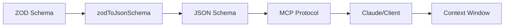

# ZOD Schema Deep Dive: Context Size Optimization Analysis

## Executive Summary

The ZOD schema validation system is the primary driver of context bloat in the MCP server, accounting for **95%+ of token consumption**. The `patch-content-type-mapi` tool alone generates **70,267 characters** of JSON Schema from ZOD definitions, consuming **11,425 tokens**. This document provides a comprehensive analysis of the problem and presents multiple optimization strategies, including potential architectural changes.

---

## Table of Contents

1. [Understanding the ZOD Schema Problem](#understanding-the-zod-schema-problem)
2. [Current Implementation Analysis](#current-implementation-analysis)
3. [The JSON Schema Explosion](#the-json-schema-explosion)
4. [Root Cause Analysis](#root-cause-analysis)
5. [Optimization Strategies](#optimization-strategies)
6. [Implementation Recommendations](#implementation-recommendations)
7. [Risk Assessment](#risk-assessment)
8. [Conclusion](#conclusion)

---

## Understanding the ZOD Schema Problem

### What is ZOD?

ZOD is a TypeScript-first schema validation library that provides:
- Runtime type checking and validation
- Type inference (TypeScript types from schemas)
- Composable schema definitions
- Built-in error messages and descriptions

### How MCP Server Uses ZOD

In the current implementation, ZOD serves three critical functions:

1. **Input Validation**: Validates tool parameters at runtime
2. **Type Safety**: Provides TypeScript types for development
3. **Schema Documentation**: Generates JSON Schema for MCP clients

### The MCP Protocol Flow



When a client connects to the MCP server:
1. Each tool registers with a ZOD schema defining its parameters
2. ZOD schemas are converted to JSON Schema format
3. JSON Schemas are sent to the client as part of tool definitions
4. The client (Claude) includes these schemas in its context window

---

## Current Implementation Analysis

### Token Consumption by Component

Based on our measurement analysis:

| Component | Tokens | Percentage | Primary Cause |
|-----------|--------|------------|---------------|
| Schema Descriptions | 31,000+ | 93.5% | ZOD `.describe()` calls |
| Tool Names | 290 | 0.9% | Tool identifiers |
| Tool Descriptions | 1,836 | 5.5% | Tool-level descriptions |
| **TOTAL** | **33,126** | **100%** | |

### Case Study: patch-content-type-mapi

Let's examine the largest offender in detail:

#### ZOD Definition (Source)
```typescript
// Input: ZOD schema with descriptions
const moveOperationSchema = z.object({
  op: z.literal("move"),
  path: z
    .string()
    .describe(`Identifies the object you want to move using a path reference. The path reference should be in format 'id:{uuid}'. Examples:
    • '/elements/id:123e4567-e89b-12d3-a456-426614174000' - Move an element
    • '/elements/id:123e4567-e89b-12d3-a456-426614174000/options/id:987fcdeb-51a2-43d1-9f4e-123456789abc' - Move a multiple choice option
    • '/content_groups/id:456e7890-a12b-34c5-d678-901234567def' - Move a content group`),
  // ... more fields
});
```

#### JSON Schema Output (What Claude Receives)
```json
{
  "type": "object",
  "properties": {
    "op": {
      "type": "string",
      "const": "move"
    },
    "path": {
      "type": "string",
      "description": "Identifies the object you want to move... [400+ characters]"
    }
  }
}
```

**Result**:
- ZOD source: ~500 characters
- JSON Schema output: **70,267 characters**
- Token consumption: **11,425 tokens**

### The Multiplication Effect

The problem compounds because:

1. **Nested Schemas**: Complex types reference other schemas
2. **Union Types**: Each variant duplicates shared properties
3. **Discriminated Unions**: Generate multiple schema branches
4. **Array Definitions**: Repeat element schemas
5. **No Reference Reuse**: `$refStrategy: "none"` inlines everything

Example multiplication:
```typescript
// ZOD: 13 element types × properties × descriptions
elementSchema = z.discriminatedUnion("type", [
  z.object({ type: "asset", ...20 properties with descriptions }),
  z.object({ type: "text", ...15 properties with descriptions }),
  // ... 11 more element types
])

// Result: 34,006 characters of JSON Schema!
```

---

## The JSON Schema Explosion

### Why JSON Schema Explodes in Size

1. **Inline Expansion**: All references are expanded inline
   ```json
   // Instead of: { "$ref": "#/definitions/referenceObject" }
   // We get the full object repeated 50+ times:
   {
     "type": "object",
     "properties": {
       "id": { "type": "string" },
       "codename": { "type": "string" }
     },
     "additionalProperties": false,
     "description": "An object with an id or codename property referencing another item. Using id is preferred for better performance."
   }
   ```

2. **Union Type Explosion**: Each union branch contains full schema
   ```json
   {
     "anyOf": [
       { /* Complete schema for type A - 1000 chars */ },
       { /* Complete schema for type B - 1200 chars */ },
       { /* Complete schema for type C - 800 chars */ }
     ]
   }
   ```

3. **Description Duplication**: Same descriptions repeated across similar fields
   - "An object with an id or codename property" appears **50+ times**
   - Rich text property descriptions repeated for each element type

### Actual Examples from Your Codebase

#### Example 1: Reference Object Pattern
```typescript
// ZOD definition (used 50+ times)
referenceObjectSchema = z.object({
  id: z.string().optional(),
  codename: z.string().optional(),
}).describe("An object with an id or codename property referencing another item. Using id is preferred for better performance.")

// Each usage generates 200+ characters in JSON Schema
// 50 uses × 200 chars = 10,000 characters!
```

#### Example 2: Element Schema Union
```typescript
// 13 element types, each with 10-30 properties
elementSchema = z.discriminatedUnion("type", [...])

// Generates 34,006 characters of JSON Schema
// Each tool using elementSchema gets this ENTIRE definition
```

---

## Root Cause Analysis

### Primary Issues

1. **Documentation in Schemas**: Mixing API documentation with validation schemas
2. **No Schema Reuse**: MCP protocol receives fully expanded schemas
3. **Verbose Descriptions**: Multi-line explanations for every field
4. **Complex Type Hierarchies**: Deep nesting and unions
5. **Protocol Limitations**: MCP expects complete JSON Schema per tool

### The Description Problem

Your schemas contain three types of descriptions:

1. **Instructional Descriptions** (90% of size)
   ```typescript
   .describe(`Array of patch operations...
   CRITICAL REQUIREMENTS:
   - ALWAYS call get-type-mapi tool before patching...
   - Use addInto/remove for array operations...
   [48 more lines]`)
   ```

2. **Reference Documentation** (8% of size)
   ```typescript
   .describe("Specifies allowed content types. Use an empty array to allow all content types.")
   ```

3. **Simple Field Labels** (2% of size)
   ```typescript
   .describe("Display name")
   ```

**Only the third type is truly necessary for schema validation!**

---

## Optimization Strategies

### Strategy 1: Minimal Descriptions (Quick Win)
**Potential Savings: 15,000-18,000 tokens (45-54% reduction)**

#### Implementation:
```typescript
// BEFORE: 400+ characters
path: z.string().describe(`Identifies the object you want to move using a path reference...
  • '/elements/id:123e4567-e89b-12d3-a456-426614174000' - Move an element...`)

// AFTER: 20 characters
path: z.string().describe("JSON Pointer path")
```

#### Systematic Approach:
1. Remove all instructional content
2. Remove all examples
3. Keep only essential field identification
4. Move documentation to external files

**Pros**: Easy to implement, maintains current architecture
**Cons**: Loses inline context for AI

---

### Strategy 2: Schema Reference System
**Potential Savings: 20,000+ tokens (60% reduction)**

#### Concept:
Instead of expanding all schemas inline, use a reference system:

```typescript
// Define shared schemas once
const SCHEMA_REGISTRY = {
  referenceObject: {
    type: "object",
    properties: {
      id: { type: "string" },
      codename: { type: "string" }
    }
  }
};

// Use references
{
  allowed_content_types: {
    type: "array",
    items: { $ref: "#/definitions/referenceObject" }
  }
}
```

#### Implementation Options:

**Option A: Modify zodToJsonSchema usage**
```typescript
const jsonSchema = zodToJsonSchema(tool.inputSchema, {
  $refStrategy: "root", // Instead of "none"
  definitions: sharedDefinitions
});
```

**Option B: Post-process JSON Schema**
```typescript
function optimizeSchema(schema: any) {
  // Extract common patterns
  // Replace with references
  // Return optimized schema
}
```

**Pros**: Dramatic size reduction, maintains validation
**Cons**: Requires MCP client support for $ref

---

### Strategy 3: Dynamic Schema Loading
**Potential Savings: 25,000+ tokens (75% reduction)**

#### Concept:
Don't send full schemas upfront, load on demand:

```typescript
// Initial registration: minimal schema
server.tool("patch-content-type-mapi", "Patch content type", {
  _schema: "complex", // Flag for dynamic loading
  _schemaUrl: "/schemas/patch-content-type"
});

// When tool is invoked, full schema is fetched
```

**Pros**: Minimal initial context
**Cons**: Requires MCP protocol extension

---

### Strategy 4: Custom Validation (No ZOD)
**Potential Savings: 28,000+ tokens (85% reduction)**

#### Concept:
Replace ZOD with custom validation:

```typescript
// Instead of ZOD schema
const validatePatchOperation = (input: any) => {
  // Manual validation
  if (!input.op || !['move', 'addInto', 'remove', 'replace'].includes(input.op)) {
    throw new Error("Invalid operation");
  }
  // ... more validation
};

// Minimal schema for MCP
const schema = {
  type: "object",
  properties: {
    op: { type: "string", enum: ["move", "addInto", "remove", "replace"] },
    path: { type: "string" },
    value: {}
  }
};
```

**Pros**: Maximum control and size reduction
**Cons**: Loss of type safety, more code to maintain

---

### Strategy 5: Alternative SDK/Protocol
**Potential Savings: Variable**

#### Options:

1. **Fork MCP SDK**: Modify to support compressed schemas
2. **Custom Protocol Layer**: Implement schema compression
3. **Alternative Validation**: Use JSON Schema directly (skip ZOD)
4. **GraphQL Approach**: Use GraphQL schema language

---

## Implementation Recommendations

### Phase 1: Immediate Optimization (1-2 days)
**Target: Reduce to < 20,000 tokens**

1. **Strip ALL verbose descriptions**
   ```typescript
   // Create utility function
   function minimalDescribe(field: string): string {
     const mapping: Record<string, string> = {
       'path': 'Path',
       'operations': 'Operations',
       'codename': 'Codename',
       // ... minimal mappings
     };
     return mapping[field] || field;
   }
   ```

2. **Remove embedded documentation**
   - Move to `/docs/schemas/` directory
   - Reference in tool descriptions

3. **Consolidate reference patterns**
   ```typescript
   // Single source of truth
   const refs = {
     id: z.string().optional(),
     codename: z.string().optional()
   };

   // Reuse everywhere without descriptions
   const referenceObject = z.object(refs);
   ```

### Phase 2: Structural Changes (3-5 days)
**Target: Reduce to < 15,000 tokens**

1. **Implement Schema Registry**
   ```typescript
   class SchemaRegistry {
     private schemas = new Map();

     register(name: string, schema: ZodSchema) {
       this.schemas.set(name, schema);
     }

     toJsonSchema(name: string): any {
       // Return optimized JSON Schema with references
     }
   }
   ```

2. **Create Schema Compiler**
   ```typescript
   // Build time: generate optimized schemas
   npm run build:schemas

   // Runtime: use pre-optimized schemas
   import optimizedSchemas from './generated/schemas.json';
   ```

3. **Implement Lazy Loading**
   - Core schemas loaded immediately
   - Complex schemas loaded on first use

### Phase 3: Protocol Evolution (1-2 weeks)
**Target: Reduce to < 10,000 tokens**

1. **Negotiate with MCP team** for protocol enhancements:
   - Schema compression support
   - Reference resolution
   - Lazy schema loading

2. **Implement custom validation layer**
   - ZOD for development/testing
   - Minimal schemas for production

3. **Consider alternative approaches**
   - GraphQL schema
   - Protocol Buffers
   - Custom schema language

---

## Detailed Implementation Plan

### Week 1: Quick Wins

#### Day 1-2: Description Removal
```typescript
// Task 1: Audit all .describe() calls
find . -name "*.ts" | xargs grep -n "\.describe(" > descriptions.txt

// Task 2: Categorize descriptions
// - Essential (keep minimal version)
// - Instructional (remove completely)
// - Examples (move to docs)

// Task 3: Implement changes
// Before:
.describe("400+ character explanation with examples...")
// After:
.describe("Path") // or remove completely if obvious
```

#### Day 3-4: Schema Consolidation
```typescript
// Create shared schema file
// src/schemas/shared.ts
export const sharedSchemas = {
  reference: z.object({
    id: z.string().optional(),
    codename: z.string().optional()
  }),

  countLimit: z.object({
    value: z.number(),
    condition: z.enum(["at_most", "exactly", "at_least"])
  }),

  // ... other shared patterns
};

// Use everywhere without descriptions
import { sharedSchemas } from './shared';
const schema = z.object({
  content_type: sharedSchemas.reference,
  // ...
});
```

#### Day 5: Testing & Measurement
```bash
# Measure improvement
npm run measure-context:baseline  # Before
# ... make changes ...
npm run measure-context:compare   # After

# Test with MCP Inspector
npx @modelcontextprotocol/inspector
```

### Week 2: Structural Optimization

#### Day 1-2: Schema Preprocessing
```typescript
// Build script: generate-optimized-schemas.ts
import { zodToJsonSchema } from 'zod-to-json-schema';
import * as schemas from './src/schemas';

const optimized = {};
for (const [name, schema] of Object.entries(schemas)) {
  optimized[name] = optimizeJsonSchema(
    zodToJsonSchema(schema, { $refStrategy: 'root' })
  );
}

fs.writeFileSync('./optimized-schemas.json', JSON.stringify(optimized));
```

#### Day 3-4: Runtime Optimization
```typescript
// Smart schema loader
class SchemaLoader {
  private cache = new Map();

  getSchema(toolName: string): any {
    if (!this.cache.has(toolName)) {
      // Load from optimized schemas
      const schema = this.loadOptimizedSchema(toolName);
      this.cache.set(toolName, schema);
    }
    return this.cache.get(toolName);
  }

  private loadOptimizedSchema(name: string): any {
    // Return minimal schema for MCP
    // Keep full schema for validation
  }
}
```

#### Day 5: Integration Testing
- Test all tools with optimized schemas
- Verify validation still works
- Ensure Claude can understand schemas

---

## Risk Assessment

### High Risk Items

1. **AI Comprehension**: Removing descriptions might confuse Claude
   - **Mitigation**: Test extensively, keep critical descriptions
   - **Rollback Plan**: Restore descriptions selectively

2. **Breaking Changes**: Schema modifications might break tools
   - **Mitigation**: Comprehensive testing suite
   - **Rollback Plan**: Version schemas, support legacy format

3. **MCP Compatibility**: Protocol might require full schemas
   - **Mitigation**: Test with actual MCP clients
   - **Rollback Plan**: Maintain full schema fallback

### Medium Risk Items

1. **Validation Errors**: Custom validation might miss edge cases
2. **Type Safety**: Removing ZOD reduces TypeScript benefits
3. **Maintenance Burden**: Multiple schema formats to maintain

### Low Risk Items

1. **Performance**: Smaller schemas = faster transmission
2. **Documentation**: External docs might be harder to find
3. **Developer Experience**: Less inline help

---

## Alternative Approaches

### 1. Server-Side Schema Storage
Instead of sending schemas to client, validate server-side:

```typescript
// Client sends minimal request
{ tool: "patch-content-type", params: { ... } }

// Server validates with full ZOD schema
// Returns structured errors if invalid
```

**Pros**: Zero schema context
**Cons**: Requires protocol change

### 2. Schema Compression
Implement custom compression:

```typescript
// Compress schemas before sending
const compressed = compressSchema(jsonSchema);
// Use abbreviated keys, remove redundancy
// Send compressed version to MCP
```

**Pros**: Maintains compatibility
**Cons**: Complex implementation

### 3. Two-Tier System
Separate concerns:

```typescript
// Tier 1: Minimal schemas for MCP (structure only)
const mcpSchema = {
  type: "object",
  properties: {
    operations: { type: "array" }
  }
};

// Tier 2: Full ZOD validation server-side
const zodSchema = z.object({
  operations: patchOperationsSchema.describe("Full documentation...")
});
```

**Pros**: Best of both worlds
**Cons**: Dual maintenance

---

## Benchmarks and Projections

### Current State (Baseline)
- Total tokens: 33,126
- Largest tool: 11,460 tokens
- Average per tool: 1,142 tokens

### After Phase 1 (Minimal Descriptions)
- Projected tokens: ~18,000 (46% reduction)
- Largest tool: ~6,000 tokens
- Average per tool: ~620 tokens

### After Phase 2 (Schema References)
- Projected tokens: ~12,000 (64% reduction)
- Largest tool: ~3,000 tokens
- Average per tool: ~414 tokens

### After Phase 3 (Full Optimization)
- Projected tokens: ~8,000 (76% reduction)
- Largest tool: ~1,500 tokens
- Average per tool: ~276 tokens

### Optimal Achievable
- Theoretical minimum: ~5,000 tokens (85% reduction)
- Would require: Custom protocol, no validation schemas sent

---

## Conclusion

The ZOD schema system, while providing excellent type safety and validation, is fundamentally incompatible with token-conscious contexts. The conversion from ZOD to JSON Schema, combined with verbose descriptions and lack of reference reuse, creates a **140x explosion** in size (500 chars → 70,000 chars for patch-content-type).

### Recommended Approach

**Immediate Action (This Week)**:
1. Strip all verbose descriptions (save 15,000+ tokens)
2. Move documentation to external files
3. Achieve < 20,000 token target

**Medium Term (Next Month)**:
1. Implement schema reference system
2. Build schema optimization pipeline
3. Achieve < 12,000 token target

**Long Term (Next Quarter)**:
1. Work with MCP team on protocol enhancements
2. Consider alternative validation approaches
3. Achieve < 8,000 token target

### Key Insight

**The fundamental problem is not ZOD itself, but using schemas for three different purposes:**
1. Runtime validation (needs full detail)
2. Type safety (needs ZOD definitions)
3. Client documentation (needs minimal structure)

**Solution**: Separate these concerns. Use ZOD for 1 & 2, generate minimal schemas for 3.

### Final Recommendation

Start with **Strategy 1 (Minimal Descriptions)** immediately. This requires no architectural changes and will deliver immediate 45-50% reduction. Then evaluate the need for more complex optimizations based on actual usage patterns.

The perfect is the enemy of the good – a 50% reduction today is better than a theoretical 85% reduction in three months.